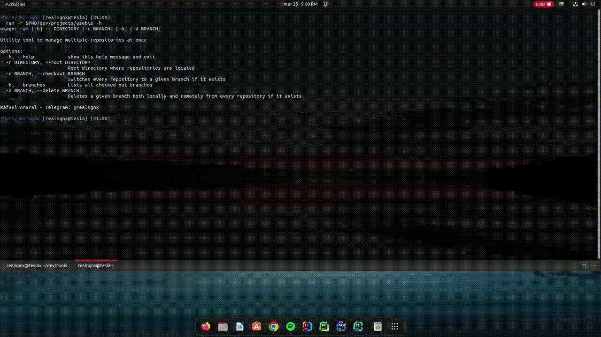

# R.A.M
Rafael Amaral (R.A.M) is a command line utility tool to manage multiple git repositories at once, being useful for individuals/large scale companies developers working with many components on a daily basis.

------------------

### Current features

+ Checking the state of all repositories within a directory, knowing which branch they are in and if there are unpushed/uncommited changes.
+ Switching all repositories to the same branch if it exists.
+ Deleting a branch from all repositories both locally and remotely.

------------------

### Demo

------------------

### TODO

+ Create branches
+ Rename branches
+ Commit changes
+ Stash changes
+ Discard changes
+ Pulling/Merging
+ Tags!

__________________

### License

Read the license [here](LICENSE).

__________________

### Contact information

If you have any questions, contact-me at Telegram: @realngnx
